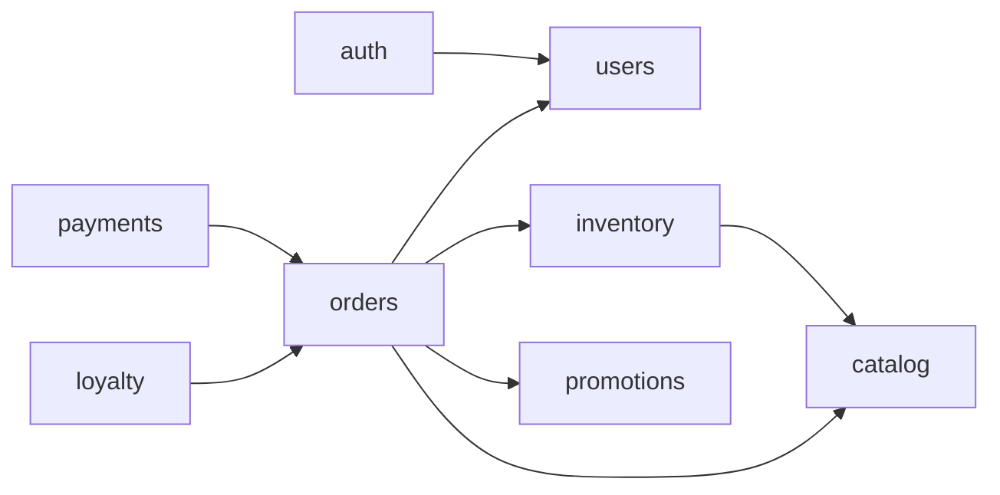

# BrewLite — Module Dependency Map

## 1. Mục đích

Tài liệu này quy định **module nào được phép phụ thuộc/gọi module nào** trong backend NestJS của BrewLite.

Mục tiêu:

- Giảm coupling giữa các module.
- Tránh việc một module truy cập trực tiếp repository của module khác.
- Giúp 5 thành viên làm song song mà ít xung đột.
- Làm rõ trách nhiệm của từng module.
- Dễ review code và mở rộng sau này.

---

## 2. Các module chính

```text
auth
users
catalog
inventory
orders
payments
promotions
loyalty
```

Ý nghĩa:

| Module | Trách nhiệm chính |
|---|---|
| `auth` | Đăng ký, đăng nhập, JWT, xác thực |
| `users` | Quản lý thông tin người dùng |
| `catalog` | Product, ProductVariant, Topping |
| `inventory` | Kiểm soát tồn kho, reservation |
| `orders` | Order, OrderItem, Order State Machine |
| `payments` | Thanh toán, idempotency, mock payment gateway |
| `promotions` | Coupon, kiểm tra điều kiện áp mã |
| `loyalty` | Cộng/trừ điểm thưởng và lịch sử điểm |

---

## 3. Dependency Map tổng thể



---

## 4. Bảng dependency chi tiết

| Module | Được phép gọi | Không nên gọi trực tiếp |
|---|---|---|
| `auth` | `users` | `catalog`, `orders`, `payments`, `inventory`, `promotions`, `loyalty` |
| `users` | Không phụ thuộc module nghiệp vụ khác | Tất cả repository của module khác |
| `catalog` | Không phụ thuộc module nghiệp vụ khác | `orders`, `payments`, `users`, `loyalty` |
| `inventory` | `catalog` | `orders`, `payments`, `promotions`, `loyalty` |
| `orders` | `users`, `catalog`, `inventory`, `promotions` | Repository nội bộ của `payments`, `loyalty` |
| `payments` | `orders` | `inventory`, `catalog`, `promotions`, repository của `orders` |
| `promotions` | Không phụ thuộc module nghiệp vụ khác | `orders`, `payments`, `inventory` |
| `loyalty` | `orders` | `payments`, `catalog`, `inventory`, repository của `orders` |

---

## 5. Luật gọi giữa các module

### 5.1. Chỉ gọi qua public service

Đúng:

```text
OrdersService
    ↓
InventoryService
```

Sai:

```text
OrdersService
    ↓
InventoryRepository
```

Module A **không được truy cập trực tiếp repository của Module B**.

---

### 5.2. Repository chỉ phục vụ module sở hữu nó

Ví dụ:

```text
inventory/
├── repositories/
│   └── inventory.repository.ts
└── services/
    └── inventory.service.ts
```

`InventoryRepository` chỉ được dùng bên trong `inventory`.

Nếu `orders` cần kiểm tra tồn kho:

```text
OrdersService
    ↓
InventoryService.reserve(...)
```

không được:

```text
OrdersService
    ↓
InventoryRepository.find(...)
```

---

### 5.3. Tránh dependency vòng tròn

Không nên:

```text
orders → payments
payments → orders
```

Cách ưu tiên trong BrewLite:

```text
payments → orders
```

Sau khi thanh toán thành công:

```text
PaymentsService
    ↓
OrdersService.markPaid(...)
```

`orders` không cần gọi ngược `payments`.

---

## 6. Dependency theo từng nghiệp vụ

### 6.1. Đăng ký / đăng nhập

```text
auth
 ↓
users
```

Ví dụ:

```text
AuthService.register()
    ↓
UsersService.createUser()
```

---

### 6.2. Xem menu

```text
catalog
```

Không cần phụ thuộc module khác.

---

### 6.3. Tạo đơn hàng

```text
orders
 ├─→ users
 ├─→ catalog
 ├─→ inventory
 └─→ promotions
```

Luồng:

```text
OrdersService.createOrder()
        ↓
kiểm tra user
        ↓
kiểm tra product / variant
        ↓
kiểm tra coupon
        ↓
reserve stock
        ↓
tạo Order + OrderItem
```

---

### 6.4. Thanh toán

```text
payments
   ↓
orders
```

Luồng:

```text
PaymentsService.pay()
        ↓
kiểm tra Idempotency-Key
        ↓
gọi MockPaymentGateway
        ↓
thành công
        ↓
OrdersService.markPaid()
```

---

### 6.5. Loyalty

```text
loyalty
   ↓
orders
```

Chỉ cộng điểm khi đơn đạt trạng thái phù hợp, ví dụ `PAID` hoặc `COMPLETED` tùy rule nhóm chốt.

---

## 7. Quyền sở hữu dữ liệu

| Module | Sở hữu dữ liệu chính |
|---|---|
| `users` | `users` |
| `catalog` | `products`, `product_variants`, `toppings`, `product_toppings` |
| `orders` | `orders`, `order_items`, `order_item_toppings`, `order_status_histories` |
| `payments` | `payments` |
| `inventory` | `inventory_reservations` |
| `promotions` | `coupons`, `coupon_redemptions` |
| `loyalty` | `loyalty_transactions` |

Nguyên tắc:

> Module nào sở hữu bảng nào thì module đó chịu trách nhiệm đọc/ghi nghiệp vụ cho bảng đó.

---

## 8. Quy tắc dành cho team

1. Không import repository từ module khác.
2. Không truy cập trực tiếp bảng do module khác sở hữu để xử lý business logic.
3. Nếu cần dữ liệu từ module khác, gọi public service của module đó.
4. Không tạo dependency vòng tròn nếu có thể tránh được.
5. Khi cần thêm dependency mới, phải cập nhật file này trước hoặc cùng Pull Request.
6. Mọi thay đổi lớn về boundary module nên được review bởi Leader/Technical Lead.

---

## 9. Dependency Map rút gọn

```text
auth
 └── users

users
 └── none

catalog
 └── none

inventory
 └── catalog

orders
 ├── users
 ├── catalog
 ├── inventory
 └── promotions

payments
 └── orders

promotions
 └── none

loyalty
 └── orders
```

---

## 10. Nguyên tắc cốt lõi

```text
Controller
    ↓
Service của chính module
    ↓
Public Service của module khác (nếu cần)
    ↓
Repository của module sở hữu dữ liệu
    ↓
Prisma
```

Không dùng:

```text
Module A Service
    ↓
Module B Repository
```

Mục tiêu là giữ BrewLite ở dạng **Modular Monolith có boundary rõ ràng**, thay vì biến toàn bộ backend thành các module phụ thuộc lẫn nhau.
