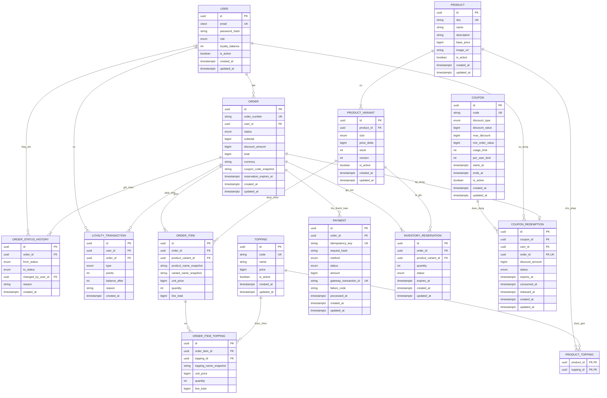

# ERD BrewLite

## 1. Sơ đồ quan hệ

## 2. Cardinality và tính bắt buộc

| Quan hệ | Diễn giải |
|---|---|
| User 1 - N Order | Mỗi đơn thuộc đúng một user; user có thể chưa có đơn |
| Product 1 - N ProductVariant | Sản phẩm phải có ít nhất một size/variant khả dụng |
| Product N - N Topping | Bảng nối giới hạn topping hợp lệ theo từng sản phẩm |
| Order 1 - N OrderItem | Không cho phép order rỗng |
| OrderItem 1 - N OrderItemTopping | Topping là tùy chọn |
| Order 1 - N Payment | Một đơn có thể thất bại rồi thử thanh toán lại |
| Order 1 - N OrderStatusHistory | Mọi lần đổi trạng thái đều phải có audit record |
| User 0..1 - N OrderStatusHistory | Người thao tác có thể được ghi nhận; null nếu transition do hệ thống/payment |
| Order 1 - N InventoryReservation | Một reservation cho mỗi variant trong đơn |
| Order 0..1 - 1 CouponRedemption | Mỗi đơn dùng tối đa một coupon |
| User/Order 1 - N LoyaltyTransaction | Ledger bảo toàn lịch sử cộng/trừ điểm |

## 3. Vì sao mô hình lớn hơn 5 entity tối thiểu

Năm entity trong đề bài đủ để demo luồng đơn giản nhưng chưa đủ chứng minh Task 10:

- `ProductVariant` biểu diễn size, giá và tồn kho độc lập.
- `OrderItemTopping` lưu nhiều topping và snapshot giá tại thời điểm mua.
- `OrderStatusHistory` chứng minh transition và hỗ trợ audit.
- `InventoryReservation` cho biết lượng tồn đang giữ/đã tiêu thụ/đã hoàn.
- `CouponRedemption` giữ lượt coupon khi order còn chờ thanh toán và chỉ chuyển `CONSUMED` sau khi trả tiền thành công; hủy/hết hạn sẽ giải phóng lượt.
- `LoyaltyTransaction` giúp cộng điểm đúng một lần và truy vết được.
- Nhiều `Payment` cho một order biểu diễn đúng các lần thử thanh toán.

## 4. Snapshot và tham chiếu

`OrderItem` vẫn giữ FK tới `ProductVariant` để truy vết, đồng thời lưu tên/giá snapshot. Khi sản phẩm đổi tên, thay giá hoặc ngừng bán, hóa đơn cũ vẫn giữ nguyên nội dung. Tương tự, `coupon_code_snapshot` và `discount_amount` trên order bảo toàn kết quả tính tiền ngay cả khi coupon được chỉnh sửa về sau.

## 5. Ràng buộc không thể hiện hết trên ERD

- Unique `(product_id, size)` trên `product_variant`.
- Unique `(product_id, topping_id)` trên `product_topping`.
- Unique `(order_id, product_variant_id)` trên `inventory_reservation`.
- Unique `(order_id, type)` cho loyalty type `EARN` để chống cộng điểm lặp.
- `coupon_redemption.status` chỉ cho `RESERVED | CONSUMED | RELEASED | EXPIRED`; `order_id` unique.
- Partial unique index chỉ cho một payment `SUCCEEDED` trên mỗi order.
- Check `stock >= 0`, `quantity > 0`, mọi giá trị tiền `>= 0`.
- Check `subtotal - discount_amount = total` và `currency = 'VND'` trong MVP.
- `from_status` có thể null ở bản ghi lịch sử đầu tiên; `to_status` không null.

Chi tiết cột, enum và vòng đời nằm trong [đặc tả entity](./entities.md) và [thiết kế cơ sở dữ liệu](./database-design.md).
