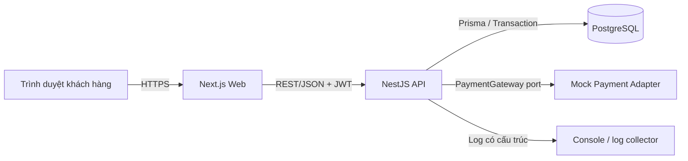
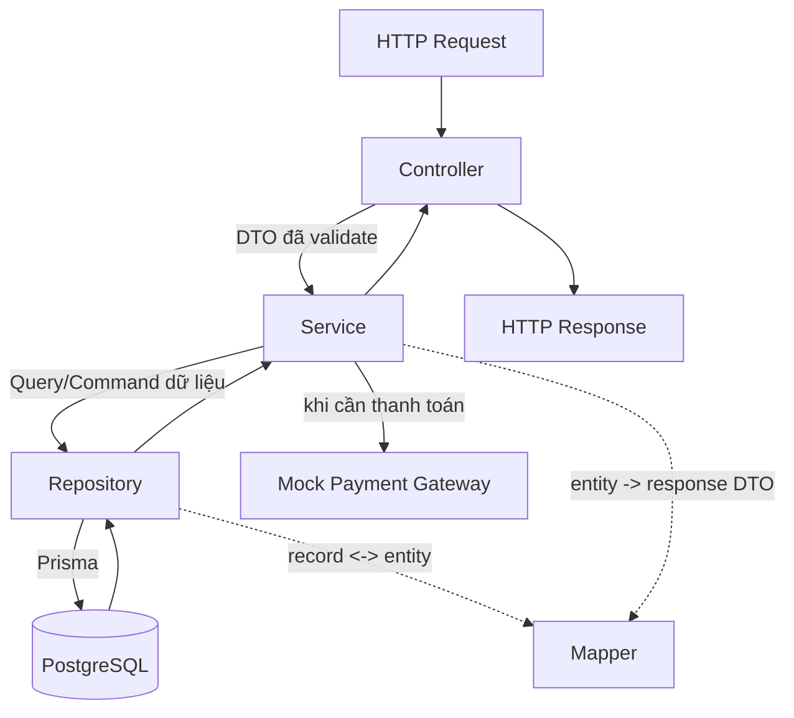
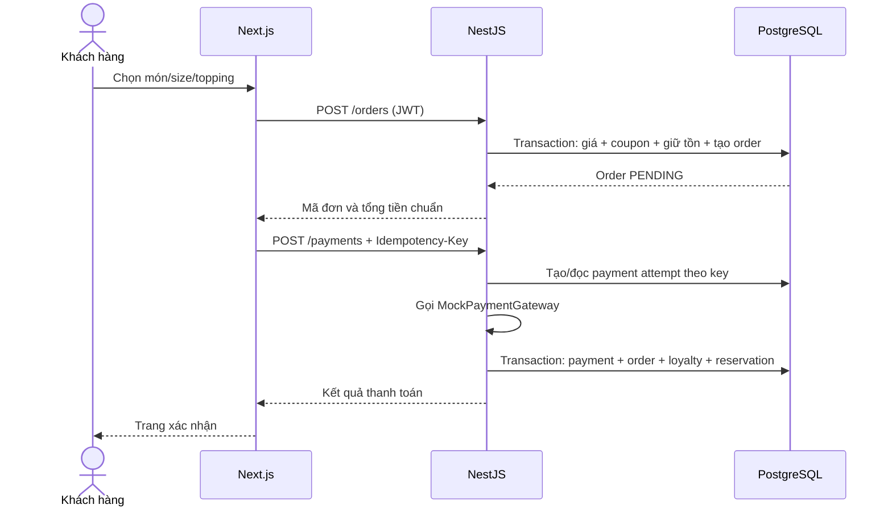

# Kiến trúc hệ thống BrewLite

## 1. Quyết định tổng thể

BrewLite dùng **modular monolith** cho backend và ứng dụng Next.js độc lập cho frontend. Trong từng module NestJS áp dụng kiến trúc phân lớp đơn giản **Controller -> Service -> Repository**. Cách này phù hợp quy mô bài tập, dễ phân công và dễ kiểm thử hơn một kiến trúc nhiều lớp trừu tượng.

- Frontend: Next.js App Router, React Query cho server state, Zustand cho giỏ hàng local.
- Backend: NestJS chia module theo nghiệp vụ; mỗi module có `controllers`, `services`, `repositories`, `mappers`, `dto`, `entities`.
- Database: PostgreSQL, truy cập qua Prisma.
- Payment: `PaymentService` gọi `PaymentGateway` interface; `MockPaymentGateway` là implementation mặc định.
- Giao tiếp: REST/JSON qua HTTPS; không truy cập trực tiếp database từ frontend.



## 2. Cấu trúc monorepo đề xuất

```text
brewlite/
├─ apps/
│  ├─ web/                       # Next.js
│  │  └─ src/
│  │     ├─ app/                 # route, layout, page
│  │     ├─ features/            # catalog, cart, auth, checkout, orders
│  │     ├─ components/          # UI dùng chung
│  │     ├─ lib/                 # API client, auth, query client
│  │     └─ stores/              # Zustand cart/session UI state
│  └─ api/                       # NestJS
│     ├─ src/
│     │  ├─ modules/             # module theo nghiệp vụ
│     │  │  └─ <module>/
│     │  │     ├─ controllers/   # HTTP, DTO, status code
│     │  │     ├─ services/      # nghiệp vụ và transaction
│     │  │     ├─ repositories/  # truy cập Prisma/PostgreSQL
│     │  │     ├─ mappers/       # Prisma record <-> Entity <-> Response DTO
│     │  │     ├─ dto/           # request/response DTO
│     │  │     └─ entities/      # model/enum nghiệp vụ
│     │  ├─ common/              # guard, filter, interceptor, pipe
│     │  ├─ config/              # validate biến môi trường
│     │  └─ main.ts
│     └─ prisma/                 # schema, migrations, seed
├─ packages/
│  ├─ contracts/                 # schema/type API công khai, không chứa nghiệp vụ backend
│  ├─ eslint-config/
│  └─ tsconfig/
├─ docs/
├─ docker-compose.yml
└─ .env.example
```

Không dùng chung trực tiếp Prisma model cho frontend. `packages/contracts` chỉ chứa enum/schema DTO công khai để tránh làm lộ cấu trúc persistence.

## 3. Kiến trúc backend theo module

### 3.1 Module nghiệp vụ

| Module | Trách nhiệm | Không được làm |
|---|---|---|
| `auth` | Đăng ký, đăng nhập, phát/xác minh token | Chứa logic đơn hàng |
| `users` | Hồ sơ, vai trò, số dư điểm đọc tối ưu | Tự tính điểm thưởng |
| `catalog` | Product, variant, topping, giá niêm yết | Tin giá do client gửi |
| `orders` | Tạo đơn, snapshot giá, state machine, lịch sử | Gọi repository của payment trực tiếp |
| `inventory` | Giữ/trừ/hoàn tồn kho bằng cập nhật có điều kiện | Quyết định trạng thái thanh toán |
| `payments` | Idempotency, payment attempt, gateway adapter | Sửa order không qua `OrderService` |
| `promotions` | Kiểm tra coupon, tính discount, redemption | Sửa bảng loyalty |
| `loyalty` | Ledger điểm, cộng/trừ điểm idempotent | Tính giá sản phẩm |

### 3.2 Controller -> Service -> Repository



Trách nhiệm từng lớp:

| Lớp | Trách nhiệm | Không được chứa |
|---|---|---|
| Controller | Route, auth/guard, đọc params/body, gọi service, map HTTP response | Business rule, Prisma query, transaction |
| Service | Điều phối nghiệp vụ, state machine, tính giá, transaction, gọi service module khác | Chi tiết HTTP hoặc serialize response thủ công |
| Repository | Đọc/ghi PostgreSQL qua Prisma, cập nhật tồn có điều kiện; gọi Mapper khi cần chuyển record | Quyết định nghiệp vụ hoặc trả HTTP exception |
| Mapper | Chuyển Prisma record sang Entity và Entity sang Response DTO | Truy vấn database, transaction hoặc business rule |
| DTO | Validate và mô tả contract request/response | Truy cập database |
| Entity/Enum | Cấu trúc và trạng thái nghiệp vụ dùng trong module | NestJS controller hoặc Prisma client |

Quy tắc phụ thuộc:

1. Luồng chuẩn là `Controller -> Service -> Repository -> Prisma`.
2. Controller không được inject Prisma hoặc repository trực tiếp.
3. Repository không gọi ngược Service và không ném `HttpException`; nó trả dữ liệu hoặc lỗi hạ tầng đã chuẩn hóa.
4. Module khác chỉ gọi public Service, không gọi Repository nội bộ.
5. Business rule phức tạp vẫn đặt trong Service hoặc pure helper/policy dưới `services`, không đặt trong Controller.
6. Transaction nhiều repository được mở và điều phối tại Service; repository nhận transaction client khi cần.
7. Mapper là helper thuần, không inject Repository/Service và không làm I/O.

Ví dụ luồng tạo đơn:

```text
OrdersController.create(dto, currentUser)
  -> OrdersService.createOrder(dto, currentUser.id)
     -> CatalogRepository.findActiveOptions(...)
     -> PromotionService.calculateDiscount(...)
     -> InventoryRepository.reserve(..., tx)
     -> OrderRepository.create(..., tx)
  -> OrderResponseDto
```

## 4. Kiến trúc frontend

| Loại state | Công cụ | Ví dụ |
|---|---|---|
| Server state | TanStack Query | menu, chi tiết, lịch sử đơn |
| Client state lâu hơn một page | Zustand + localStorage | giỏ hàng |
| Form state | React Hook Form + schema validation | đăng nhập, checkout |
| Auth | cookie HttpOnly ưu tiên; hoặc memory + cơ chế refresh | access/refresh token |

Mỗi `feature` chứa component, hook, query key, API function và test của chính nghiệp vụ đó. Route trong `app/` chỉ compose feature, tránh đặt business rule trong page component.

Luồng request:



## 5. Luồng tạo đơn và giữ tồn kho

`POST /orders` chạy trong một transaction ngắn:

1. Xác thực user và kiểm tra giỏ không rỗng.
2. Đọc variant/topping đang hoạt động và tính giá server-side.
3. Kiểm tra coupon, tính `subtotal`, `discountAmount`, `total`; nếu dùng coupon thì giữ lượt bằng `CouponRedemption(RESERVED)`.
4. Với từng variant, trừ tồn bằng cập nhật nguyên tử với điều kiện `stock >= quantity`; nếu không cập nhật được dòng nào thì báo hết hàng/xung đột tồn kho.
5. Tạo `Order`, `OrderItem`, `OrderItemTopping`, `InventoryReservation` và `OrderStatusHistory`.
6. Commit rồi trả order `PENDING`.

Không giữ transaction trong khi gọi payment gateway. Nếu gateway chậm, kết nối database không bị chiếm giữ.

## 6. Luồng thanh toán idempotent

1. Chuẩn hóa payload và tính `requestHash`.
2. Tìm `Payment` theo `idempotencyKey`.
3. Nếu đã tồn tại:
   - cùng hash: trả nguyên kết quả đã lưu;
   - khác hash: trả `409 IDEMPOTENCY_KEY_REUSED`.
4. Nếu chưa tồn tại, tạo payment `PROCESSING` với unique key. Race do hai request đồng thời được unique constraint chặn; request thua đọc lại bản ghi đã thắng.
5. Gọi mock gateway ngoài transaction.
6. Trong transaction mới, khóa/kiểm tra order, cập nhật payment và transition order đúng một lần.
7. Khi thành công: `PENDING -> PAID`, consume inventory reservation, chuyển coupon redemption `RESERVED -> CONSUMED` (nếu có), ghi lịch sử và cộng loyalty với unique `(order_id, type)`.
8. Khi thất bại: chuyển `PAYMENT_FAILED`; inventory/coupon reservation được giữ trong thời gian retry và được release/expire nếu order hủy hoặc quá hạn.

## 7. Nhất quán và lỗi

- Các thay đổi bắt buộc đồng bộ trong cùng PostgreSQL được gói trong transaction.
- Tác vụ có thể lặp lại đều có khóa idempotency hoặc unique business key.
- Cập nhật tồn dùng điều kiện `WHERE stock >= quantity`; chỉ transaction trừ tồn thành công mới tạo reservation.
- HTTP status chỉ là lớp vận chuyển; response luôn có `error.code`, `message`, `details`, `requestId`.
- Không trả stack trace/Prisma error cho client.
- Với MVP, xử lý nội bộ chạy đồng bộ trong Service. Nếu tích hợp dịch vụ thật, bổ sung transactional outbox thay vì phát message trước khi commit.

## 8. Chiến lược kiểm thử

| Cấp | Phạm vi bắt buộc |
|---|---|
| Unit | `assertTransition`, pricing, coupon policy, loyalty calculation |
| Integration | Prisma repository, transaction giữ/hoàn tồn, idempotency concurrent |
| API/e2e | register -> login -> order -> payment -> history |
| Frontend component | menu states, cart calculation, payment error/success |

Ba test chấm điểm Task 10 phải có: transition sai bị chặn; hai request cùng idempotency key chỉ có một payment thành công; nhiều request concurrent không làm stock âm.

## 9. Khả năng mở rộng

- Payment thật: thêm implementation mới cho `PaymentGateway`, giữ nguyên cách gọi trong `PaymentService`.
- Nhiều chi nhánh: thêm `Store`, `InventoryBalance` theo `storeId`.
- Tồn kho nguyên liệu: thay stock trên variant bằng `Ingredient`, `Recipe`, `InventoryBalance` mà không đổi hợp đồng order.
- Real-time: phát `OrderStatusChanged` qua outbox và WebSocket/SSE.
- Tách service chỉ khi có nhu cầu scale/ownership độc lập; ranh giới module hiện tại là ứng viên tách tự nhiên.
