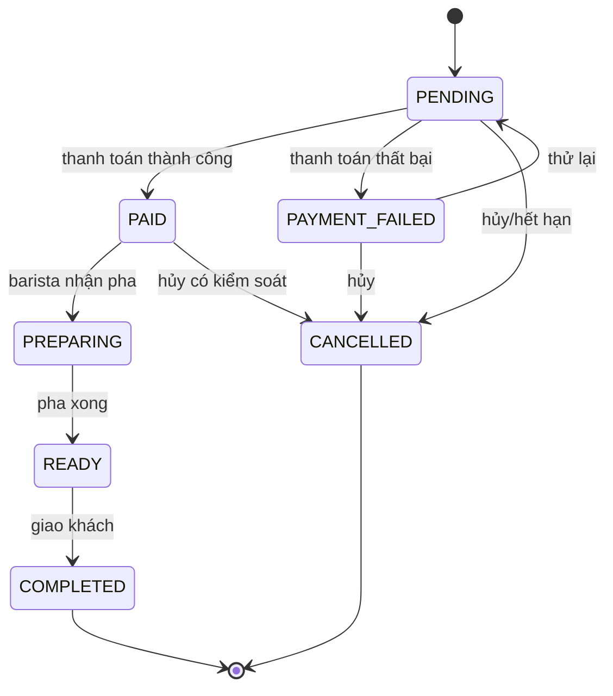

# Phân tích đề bài BrewLite

## 1. Mục tiêu sản phẩm

BrewLite là ứng dụng web đặt đồ uống và thanh toán không tiền mặt. Giá trị cốt lõi là rút ngắn thời gian xếp hàng: khách chọn món, tùy chọn size/topping, thanh toán và nhận mã đơn trước khi đến quầy.

Công nghệ bắt buộc từ đề bài:

- Frontend: Next.js, React, TypeScript.
- Backend: NestJS, TypeScript, REST API.
- Cơ sở dữ liệu quan hệ: chọn PostgreSQL.
- ORM: tài liệu này chọn Prisma.
- Xác thực: JWT và mật khẩu băm bằng bcrypt.
- Thanh toán: cổng giả lập theo giao diện Ví/Thẻ.
- Vận hành local: Docker Compose cho frontend, backend và PostgreSQL.

## 2. Phạm vi MVP

### Trong phạm vi

- Xem menu và chi tiết sản phẩm.
- Chọn biến thể kích thước và topping.
- Quản lý giỏ hàng phía client, tự hiển thị tổng tạm tính.
- Đăng ký, đăng nhập và gọi API được bảo vệ bằng JWT.
- Tạo đơn ở trạng thái `PENDING`; backend kiểm tra lại giá và tồn kho.
- Thanh toán Ví/Thẻ qua mock gateway với `Idempotency-Key`.
- Xem mã đơn, trạng thái đơn và lịch sử đơn của chính khách hàng.
- State machine đơn hàng, chống thanh toán lặp, kiểm soát đặt đồng thời, mã giảm giá và điểm thưởng.
- Unit test/integration test cho các nghiệp vụ trọng yếu.

### Ngoài phạm vi MVP

- Kết nối Momo/VNPay/Stripe thật và đối soát tiền thật.
- UI vận hành đầy đủ cho Barista/Admin.
- Giao hàng, nhiều chi nhánh, thuế/hóa đơn điện tử.
- Quản lý công thức nguyên liệu chi tiết theo từng gram/ml.
- WebSocket/push notification thời gian thực.

Các mục ngoài phạm vi có thể bổ sung sau mà không đổi cấu trúc lõi nhờ module `payment`, `inventory` và state machine đã được cô lập.

## 3. Tác nhân và quyền

| Tác nhân | Khả năng trong MVP | Ghi chú |
|---|---|---|
| Khách chưa đăng nhập | Xem menu, chọn món, quản lý giỏ local | Phải đăng nhập trước khi tạo đơn |
| Khách hàng | Tạo đơn, thanh toán, hủy khi hợp lệ, xem lịch sử của mình | Vai trò `CUSTOMER` |
| Barista | Cập nhật `PAID -> PREPARING -> READY -> COMPLETED` | API hỗ trợ Task 10; UI là phần mở rộng |
| Quản trị viên | Quản lý menu/khuyến mãi và can thiệp vận hành | Ngoài UI MVP |
| Mock Payment Gateway | Trả kết quả thanh toán thành công/thất bại | Được bọc bởi adapter để thay thế sau |

## 4. Yêu cầu chức năng chuẩn hóa

| Mã | Yêu cầu | Điều kiện chính |
|---|---|---|
| FR-01 | Xem menu | Có loading, empty và error state |
| FR-02 | Xem chi tiết | Chỉ hiển thị sản phẩm/biến thể đang hoạt động |
| FR-03 | Tùy chọn món | Chọn đúng một size và nhiều topping hợp lệ |
| FR-04 | Quản lý giỏ | Thêm, đổi số lượng, xóa; giỏ lưu local |
| FR-05 | Đăng ký/đăng nhập | Email duy nhất; cấp access token JWT |
| FR-06 | Tạo đơn | Backend tính lại toàn bộ giá, giữ tồn kho, tạo mã đơn |
| FR-07 | Thanh toán | Chỉ thanh toán đơn của chính user; idempotent theo header |
| FR-08 | Xác nhận/lịch sử | Trả mã đơn, trạng thái và danh sách đơn phân trang |
| FR-09 | Vận hành trạng thái | Chỉ cho phép transition được khai báo trong state machine |
| FR-10 | Khuyến mãi/loyalty | Kiểm tra coupon; cộng điểm đúng một lần sau khi thanh toán thành công |

## 5. Yêu cầu phi chức năng

| Mã | Mục tiêu có thể kiểm thử | Cách đáp ứng |
|---|---|---|
| NFR-01 | API đọc/ghi thông thường p95 < 500 ms với dữ liệu mẫu | Index đúng, phân trang, tránh N+1, đo bằng integration/load test |
| NFR-02 | Không lưu mật khẩu rõ | Băm bằng bcrypt với cost phù hợp và được đo trên môi trường chạy |
| NFR-03 | Dữ liệu đầu vào được kiểm tra | DTO + `class-validator`, whitelist và transform |
| NFR-04 | Không bán quá tồn kho khi có request đồng thời | Transaction + cập nhật nguyên tử `WHERE stock >= quantity`; chỉ retry lỗi serialization/deadlock |
| NFR-05 | Retry thanh toán không tạo giao dịch kép | Unique `idempotency_key` và trả lại kết quả đã lưu |
| NFR-06 | Chạy nhất quán trên máy thành viên | Docker Compose, migration và seed có version |
| NFR-07 | Quan sát được lỗi | Correlation ID, log có cấu trúc, không log bí mật |
| NFR-08 | Tương thích trình duyệt hiện đại | Responsive UI; kiểm thử Chrome/Edge/Firefox bản hiện hành |

## 6. Quy tắc nghiệp vụ quan trọng

1. Frontend chỉ gửi `productVariantId`, `toppingIds`, `quantity` và coupon; mọi giá trị tiền được backend tra lại.
2. Một đơn phải có ít nhất một item, số lượng mỗi item nằm trong giới hạn cấu hình.
3. Tổng tiền: `subtotal - discountAmount = total`; `total >= 0`.
4. Giá/tên món, biến thể và topping được snapshot vào dòng đơn để lịch sử không đổi khi menu được cập nhật.
5. `Idempotency-Key` là bắt buộc cho `POST /payments`, unique toàn hệ thống và gắn với hash của request. Dùng lại cùng key nhưng khác payload bị từ chối.
6. Tồn kho được giữ trong transaction tạo đơn. Khi thanh toán thành công, reservation chuyển thành `CONSUMED`; khi hủy/hết hạn/thanh toán thất bại cuối cùng, tồn kho được hoàn lại đúng một lần.
7. Điểm thưởng được ghi bằng ledger `LoyaltyTransaction`, không chỉ cập nhật một con số. Mỗi đơn chỉ có tối đa một giao dịch cộng điểm.
8. Transition ngoài sơ đồ trạng thái phải trả lỗi `409 ORDER_INVALID_TRANSITION`.

## 7. State machine đơn hàng

`COMPLETED` và `CANCELLED` là trạng thái kết thúc. Nếu cho phép hủy sau `PAID`, hệ thống phải hoàn tiền/ghi nhận hoàn tiền; mock MVP có thể giới hạn thao tác này cho `ADMIN`.

## 8. Truy vết 10 task của đề bài

| Task | Đầu ra kỹ thuật | Tài liệu liên quan |
|---|---|---|
| 1 | Monorepo, env mẫu, chạy được frontend/backend | Kiến trúc hệ thống, Docker |
| 2 | `GET /products` | API, Product/ProductVariant/Topping |
| 3 | Trang menu | Kiến trúc frontend |
| 4 | Chi tiết, size, topping | ERD và quy tắc định giá |
| 5 | Giỏ hàng client | Kiến trúc frontend; backend không tin giá client |
| 6 | `POST /orders` | Order, OrderItem, reservation, transaction |
| 7 | Auth JWT | API và tài liệu bảo mật |
| 8 | Thanh toán mock | Payment, idempotency, payment adapter |
| 9 | Xác nhận/lịch sử/Docker | API, Docker, observability |
| 10 | State machine, idempotency, concurrency, promotion/loyalty | Toàn bộ tài liệu architecture và test strategy |

## 9. Giả định cần nhóm xác nhận

- Một cửa hàng và một loại tiền tệ `VND` trong MVP.
- Tồn kho quản lý theo `ProductVariant`, chưa tách nguyên liệu/công thức.
- Giỏ hàng không lưu server; checkout tạo snapshot đơn hàng.
- Mỗi đơn có tối đa một coupon và có thể có nhiều lần thử thanh toán.
- Một `Payment` là một lần thử; chỉ một lần thử có trạng thái `SUCCEEDED` cho mỗi đơn.
- Access token ngắn hạn; refresh token là phần khuyến nghị, không phải endpoint tối thiểu của đề bài.

Nếu một giả định thay đổi, cập nhật ADR và ERD trước khi sửa migration để tránh lệch giữa thiết kế và mã nguồn.
